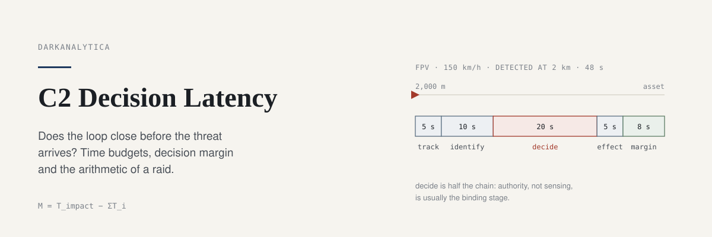
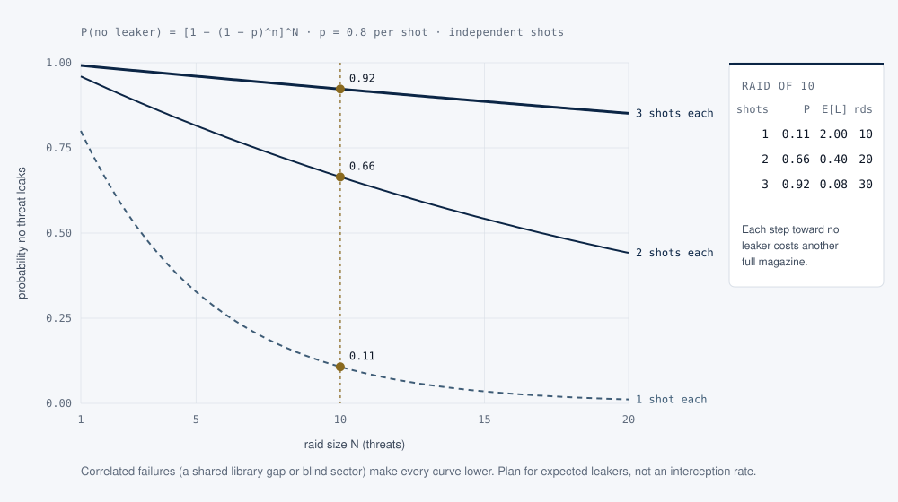

<p align="center">
  
</p>

## What this is

A small, tested Python package and field notes for the timing and probability arithmetic of command and control: the decision-cycle latency budget, decision margin against a closing threat, layered-defence raid mathematics (probability that no threat leaks through, expected leakers, rounds used), how denied, degraded, intermittent and limited communications stretch the loop, and the trade between centralised and distributed control. Pure standard library, with a command line interface and tests that reproduce every worked example below.

## Why it matters

Almost every defence software product claims to shorten the decision cycle. The claim is testable: a loop either closes before the threat arrives or it does not, and the sum of stage latencies says which stage binds. For a small attack drone detected at 2 km, a 40 second chain leaves 8 seconds; double the decision time and the defence arrives 12 seconds late with the same sensors. The same discipline applies to layered defence, where "95% interception" says nothing about a twenty-threat raid, and to network design, where a loop that needs a round trip to the centre stops closing exactly when the adversary attacks the link.

<p align="center">
  
</p>
<p align="center"><sub><b>Figure 1.</b> The engagement chain against its time budget. A drone at 150 km/h detected at 2 km closes in 48 s. Track, identify, decide and effect use 40 s; the decision and its authority are half of it.</sub></p>

## Quick start

```bash
git clone https://github.com/darkanalytica1/c2-decision-latency
cd c2-decision-latency
python -m c2latency margin --range-m 2000 --speed-kmh 150 --stage track=5 identify=10 decide=20 effect=5
python -m c2latency raid --threats 10 --p 0.8 --shots 1 2 3 --target 0.9
python -m c2latency layers --threats 10 --layer outer:0.5:1 inner:0.8:2
python -m c2latency ddil
python -m c2latency compare
```

```text
$ python -m c2latency margin --range-m 2000 --speed-kmh 150 --stage track=5 identify=10 decide=20 effect=5
time to impact     48.0 s  (detect 2,000 m, min range 0 m, 41.7 m/s)
  track             5.0 s  ####
  identify         10.0 s  ########
  decide           20.0 s  #################
  effect            5.0 s  ####
chain total        40.0 s
decision margin    +8.0 s  (closes in time)
binding stage    decide (50% of chain)
zero-margin detection range 1,667 m; fastest beatable threat 50.0 m/s

$ python -m c2latency raid --threats 10 --p 0.8 --target 0.9
raid of 10, single-shot p = 0.8
shots  P(no leaker)  E[leakers]  rounds
    1         0.107        2.00      10
    2         0.665        0.40      20
    3         0.923        0.08      30
shots per threat for P(no leaker) >= 0.9: 3
```

Add `--ddil intermittent --hops 3 --stage ... comms=0` to `margin` to see the same chain under degraded communications: three intermittent hops turn the 8 s margin into −5.5 s.

From Python:

```python
from c2latency import LatencyBudget, kmh_to_ms, p_raid_annihilation, layered_raid, Layer, PRESETS, delivery_time

b = LatencyBudget(2000, kmh_to_ms(150), {"track": 5, "identify": 10, "decide": 20, "effect": 5})
b.margin_s, b.binding_stage              # (8.0, 'decide')
b.with_stage("decide", 40).margin_s      # -12.0

p_raid_annihilation(10, 0.8, shots=2)    # 0.665
layered_raid(10, [Layer("outer", 0.5, 1), Layer("inner", 0.8, 2)]).pra   # 0.817
delivery_time(PRESETS["limited"], message_bits=2_000_000)                # 208.8 s for a video clip
```

## Method

| Question | Formula | Worked example (tested) |
|---|---|---|
| Time available | T_impact = (R_detect − R_min) / v | 2,000 m at 41.7 m/s → 48 s |
| Does the loop close? | M = T_impact − ΣT_i | 48 − (5 + 10 + 20 + 5) = 8 s; decision 40 s → −12 s |
| With a minimum range | same | 3,000 m, 300 m floor, 30 m/s → 90 s; 80 s loop → +10 s; at 60 m/s → −35 s |
| No threat leaks | P_RA = [1 − (1 − p)^n]^N | N 10, p 0.8: 0.107, 0.665, 0.923 for 1, 2, 3 shots |
| Expected leakers and rounds | E[L] = N(1 − p)^n, M = nN | 2.0, 0.4, 0.08 leakers; 10, 20, 30 rounds |
| Layers | leak = Π(1 − p_i)^(n_i) | outer 0.5×1, inner 0.8×2 → 0.02 per threat, P_RA 0.817 |
| Delivery under DDIL | attempt/(1 − loss) + timeout·loss/(1 − loss) + (1 − up)·outage | connected 0.5 s, degraded 1.6 s, intermittent 4.5 s, denied never |
| Central vs edge | loop = local + hops·(up + down) + queue + decide + act | 48 s central vs 30 s edge; central loop possible 26% under intermittent links |

<p align="center">
  
</p>
<p align="center"><sub><b>Figure 2.</b> Probability that no threat leaks through, against raid size. Magazine depth, not single-shot quality alone, sets the ceiling of an active defence.</sub></p>

Full notes, including the OODA framing, defence as the harder control problem, DDIL failure modes, centralised versus distributed trade-offs and a closing checklist, are in [docs/METHOD.md](docs/METHOD.md).

## Limitations and assumptions

- **Constant closing speed and a single threat axis.** Time to impact assumes straight-line approach at constant speed from first reliable detection. Manoeuvre, altitude changes and detection gaps are not modelled.
- **Stage latencies are inputs.** The package adds them; it does not estimate them. Measure them in rehearsal, including every communications hop and the time to obtain authority.
- **Independent shots and layers.** Raid probabilities assume independent engagements. Correlated failures (a shared library gap, a blind sector, a saturated tracker) make every number worse; `common_mode_pra` shows the ceiling this imposes. Reload, retargeting time and look-shoot-look doctrine are not modelled.
- **The DDIL and architecture models are first-order teaching models** by the author: exponential outages, independent hops, a fixed attention queue at the centre. They show which condition breaks which assumption; they are not network simulations.
- **No system is described.** All numbers are illustrative. Nothing here describes the performance of any fielded sensor, effector or C2 product.
- **Educational and defensive.** The arithmetic is standard and widely published; its purpose is to make requirements, acceptance tests and architecture claims testable.

## Tests

```bash
pip install -r requirements.txt
python -m pytest -q
```

Python 3.10+. No runtime dependencies. Tests run on GitHub Actions for Python 3.10 to 3.13.

## Sources

Boyd (1986, 1996) and Osinga (2007) on the decision cycle; ATP 3-01.81 and the JIATF-401 C-sUAS Quick Reference Guide on the engagement chain; Washburn and Kress (2009) and Hughes (1995) on engagement probability; Benaskeur (2026, NATO C2COE Annals) on defence as disturbance rejection and holonic C2; Ogata (2010); Alberts and Hayes (2003); RFC 4838 on delay-tolerant networking. Full list in [docs/SOURCES.md](docs/SOURCES.md).

## Licence

MIT. See [LICENSE](LICENSE).

<sub>DarkAnalytica · educational material from public sources and original synthesis.</sub>
